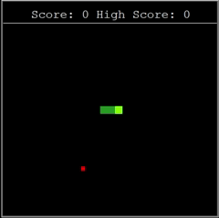

# SnakeGame
A simple Snake game built in Python using the turtle module.

**Snake Game** 🐍

This is a custom variant of the classic Snake game, developed as part of Dr. Angela Yu’s course, “_100 Days of Code: The Complete Python Pro Bootcamp_”.

The core gameplay remains true to the original, including snake movement, food generation, and the scoring system, with several enhancements and modifications:

### **Features & Enhancements**

• **Live High Score Updates:** The high score and session score now update in real-time when you surpass your previous best, without needing to end the game.

• **Dynamic Food Colors:** Each time the food respawns, its color changes randomly.

• **Expanded Controls:** Additional keybinds have been added for snake movement.

• **Distinct Snake Head:** The snake’s head is highlighted in chartreuse, while the rest of the body remains forest green, improving visual clarity.

### **Known Issues**

• The game is primarily designed for **windowed mode.** Playing in full-screen may result in collision issues with the border, though food will still spawn within reachable areas.

• Minor collision glitches with the border may still occur even in windowed mode.

• Food Spawn Glitch: Occasionally, food may spawn underneath the snake. You will need to wait until the snake moves off it for it to be visible.

### **Installation & Usage**

**1. Download the game files**  
  Click the green Code button and choose Download ZIP.

**2. Extract the files (if downloaded as ZIP).**   

**3. Open the project in Python**   
  Open the folder in PyCharm, VS Code, or any Python IDE of your choice.

**4. Run the Game**   
  Open snake_game.py in your IDE and run it.

